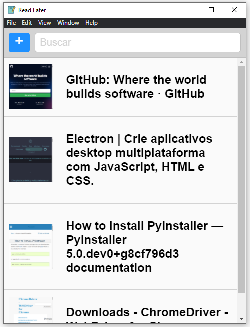

## Descriptions

App to save website links for future reading. Developed with the help of udemy's Ray Viljoen course - Master Electron: Desktop Apps with HTML, JavaScript & CSS:  [HERE](https://www.udemy.com/course/master-electron/#instructor-1).

#### Interface


## Installation

To install prebuilt Electron binaries, use [`npm`](https://docs.npmjs.com/).
The preferred method is to install Electron as a development dependency in your
app:

```sh
npm install electron --save-dev
```
## License

[MIT](https://github.com/electron/electron/blob/master/LICENSE)

When using the Electron or other GitHub logos, be sure to follow the [GitHub logo guidelines](https://github.com/logos).
